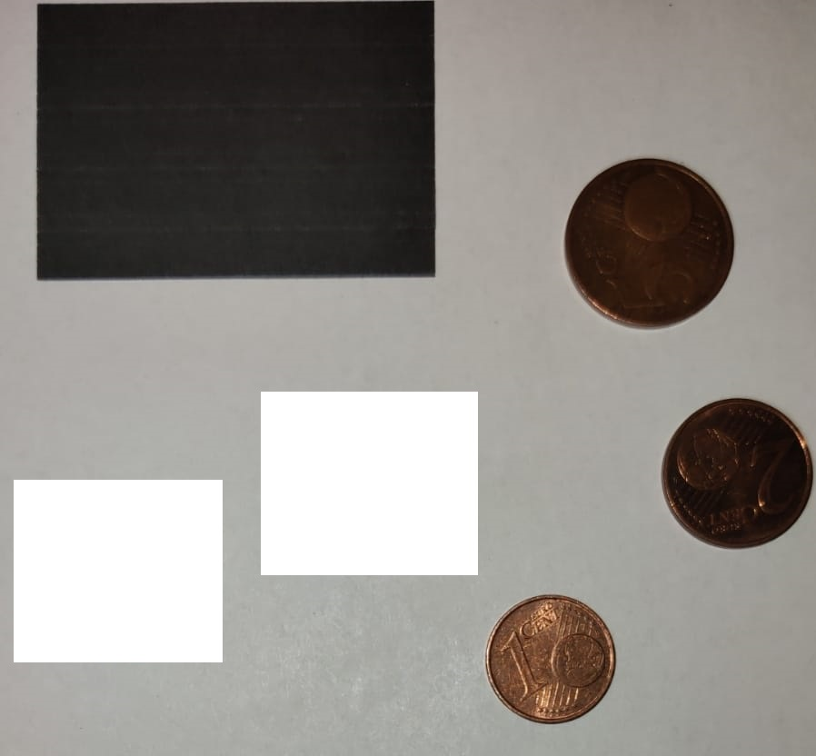

# CoinCount

CoinCount is a program to count the value of coins in an image with the help of a SVM.
> ONLY FOR FOLLOWING EUR COINS
> *   1 cent
> *   2 cent
> *   5 cent

## Properties of image
*  White background.
*  Reference object has to be black and a rectangle.

## Programs
### coincount.py
Using the programs from comand line.

### count.py
Counts the value of coins in an image.

**Procedure:**
1.  Creates binary image out of input image and get contours.
2.  Searches for coins and reference objct and gets perimeter, area, mean color (coin) and the length of the sides (reference object).
3.  Calculates length of pixel with reference object.
4.  Converts area and perimeter of coin with reference object.
5.  Predict value of coins and count coins.

### newcoin.py 
Adds new coins to the CSV-files for training a Support Vector Machine.

**Procedure:**
1.  1 to 4 like count.py
2.  Write perimeter, area and mean color to csv file.

### svm.py
Trains a Support Vector Machine.

**Procedure:**
1.  Read csv files.
2.  Train SVM.
3.  Write SVM to file.

### coincount_lib.py
Library for the programs.

## Needed Libraries

**openCV:** 
`pip install opencv-python`

**scikit-learn:** 
`pip install -U scikit-learn`

**numpy:**
`pip install numpy`

## Example
The following input image 

## Contribution
Feel free to contribute: add new types of coins, improve the SVM, ...
